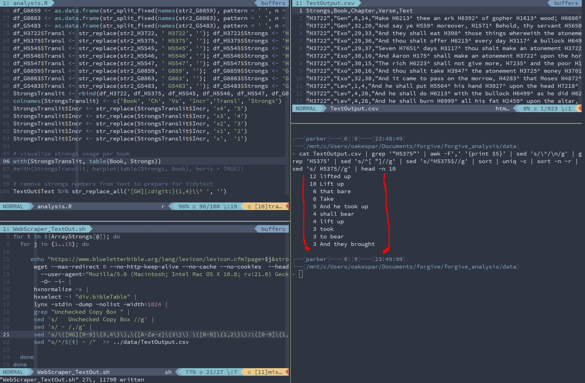

### Overview

In my nerdy bible study tonight (shown in the picture below), I found something
so profound, amazing and simple...

I was looking for the most common word usage of forgiveness throughout the
Bible and its this Hebrew word [ נָשָׂא - nāśā'] with the Strongs number H5375,
and it shows up all throughout the Bible!

### Example Uses

The word picture is so powerful as shown in its top 10 uses:

- lifted up __(12x)__
- Lift up __(10x)__
- that bare __(6x)__
- Take __(6x)__
- And he took up __(5x)__
- shall bear __(4x)__
- lift up __(4x)__
- took __(3x)__
- to bear __(3x)__
- And they brought __(3x)__

### Seeing It In Scripture

These are Old Testament Hebrew uses, but look at what the New Testament says
pertaining to Jesus Christ being the forgiveness of God by "bearing our sin"
and humanity being reconciled to God's image and purpose by "bearing"...

> John 12:32; "And I, if I be lifted up from the earth, will draw all men unto me."

> John 3:14; "And as Moses lifted up the serpent in the wilderness, even so must the Son of man be lifted up:"

> Luke 14:27; "And whosoever doth not bear his cross, and come after me, cannot be my disciple.

> 1 Peter 2:24; "Who his own self bare our sins in his own body on the tree, that we, being dead to sins, should live unto righteousness: by whose stripes ye were healed.""]
