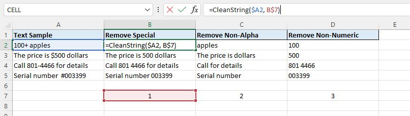

Here is a free Excel Add-In to clean dirty text the easy way!



### Back Story

I have had to make several text cleaning functionalities for the front-end of
Excel lately due banking entries, randomized strings, you name it.

I thought, why not just build an Add-In I can install in any workbook that
needs it? Also, I figured you guys could use it since there doesn’t seem to be
any Excel function like this.

### How To Use It

1. Select the cell with the string.
2. Select options `1`, `2` or `3` for whichever type of procedure you want.

### Download It

Feel free to download the Excel Add-In or just fork my [repository](https://github.com/alanoakes/CleanString_ExcelAddIn)
if you want to modify the function.

#### VBA Class

Here is the code in a `VBA` Class module if you feel comfortable plugging it in:

```vb
' Declarations
' ━━━━━━━━━━━━━━━━━━━━━━━━━━━━━━━━━━━
Option Explicit
Private i    As Long
Private iStr As String
Private list As Object
Private var  As Variant

' Options Enumerator
' ━━━━━━━━━━━━━━━━━━━━━━━━━━━━━━━━━━━
Public Enum optStr
  Alpha_
  Numer_
  Specl_
End Enum

' Class Initializer for the ArrayList
' ━━━━━━━━━━━━━━━━━━━━━━━━━━━━━━━━━━━
Private Sub Class_Initialize()
  Set list = CreateObject("System.Collections.ArrayList")
End Sub

' Main Function (Returns String)
' ━━━━━━━━━━━━━━━━━━━━━━━━━━━━━━━━━━━
Public Function oMain(oStr As String, opt As optStr) As String
  iStr = oStr
  Select Case opt
    Case optStr.Alpha_: oMain = clnStr(iStr, Array(32, 65, 66, 67, 68, 69, 70, 71, 72, 73, 74, 75, 76, 77, 78, 79, 80, 81, 82, 83, 84, 85, 86, 87, 88, 89, 90, 97, 98, 99, 100, 101, 102, 103, 104, 105, 106, 107, 108, 109, 110, 111, 112, 113, 114, 115, 116, 117, 118, 119, 120, 121, 122))
    Case optStr.Numer_: oMain = clnStr(iStr, Array(32, 48, 49, 50, 51, 52, 53, 54, 55, 56, 57))
    Case optStr.Specl_: oMain = clnStr(iStr, Array(32, 48, 49, 50, 51, 52, 53, 54, 55, 56, 57, 65, 66, 67, 68, 69, 70, 71, 72, 73, 74, 75, 76, 77, 78, 79, 80, 81, 82, 83, 84, 85, 86, 87, 88, 89, 90, 97, 98, 99, 100, 101, 102, 103, 104, 105, 106, 107, 108, 109, 110, 111, 112, 113, 114, 115, 116, 117, 118, 119, 120, 121, 122))
  End Select
End Function

' Supporting Function
' ━━━━━━━━━━━━━━━━━━━━━━━━━━━━━━━━━━━━
Private Function clnStr(str As String, arr As Variant) As String
  MakeSeq arr
  For i = 1 To Len(str)
    Select Case list.Contains(Asc(Mid(str, i, 1)))
      Case True
      Case False: Mid(str, i, 1) = " "
    End Select
  Next i
  list.Clear
  str = Application.Trim(str)
  clnStr = str
End Function
```
